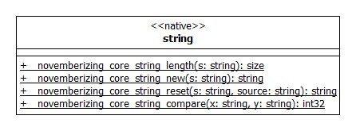

# NOVEMBERIZING CORE STRING

문자열 관련한 메서드들 입니다. 내부적으로 strlen, strncmp 등을 사용하며, 사용하기 쉽도록 그리고 내부적인 사용은 여러 운영체제마다 사용하는 API가 다르더라고, 외부적으로는 같은 API 를 사용하도록 그리고 에러 처리를 내부적으로 하도록 하기 위해서 감싼 것 입니다.



## PROTOTYPE

```
__novemberizing_core_string_length(s: string): size
__novemberizing_core_string_new(s: string): string
__novemberizing_core_string_reset(s: string, source: string): string
__novemberizing_core_string_compare(x: string, y: string): int32
```

문자열 관련한 메서드들입니다. 문자열의 길이를 구하거나, 혹은 새로운 문자열 변수를 생성하거나 두 문자열 간의 차이를 구하는 메서드들로 구성되어 있습니다.

### 문자열 길이

문자열의 길이를 구하려면 \_\_novemberizing_core_string_length(s: string): size 메서드를 호출하면 됩니다. C-STYLE 의 문자열로 '\0'까지의 길이를 출력하게 됩니다.

#### PARAMETER

| PARAMETER | TYPE   | DIRECTION | DESCRIPTION     |
| --------- | ------ | --------- | --------------- |
| s         | string | in        | original string |

#### RETURN

| TYPE | DESCRIPTION        |
| ---- | ------------------ |
| size | length of a string |

#### SAMPLE

```
    const char * x = "hello";
    const char * y = "world";
#ifdef    WIN32
    printf("length: %d\n", __novemberizing_core_string_length(x));
#else  // WIN32
    printf("length: %ld\n", __novemberizing_core_string_length(x));
#endif // WIN32
```

> WINDOWS 32 size 의 길이가 32 비트이기 때문에, 컴파일 시에 string format 을 명확히 기재해야 경고를 출력하지 않는다.

### 문자열 생성

원본 문자열로부터 독립적인 새로운 문자열을 새롭게 생성하려면 \_\_novemberizing_core_string_new(s: string): string 메서드를 호출하면 됩니다.

#### PARAMETER

| PARAMETER | TYPE   | DIRECTION | DESCRIPTION     |
| --------- | ------ | --------- | --------------- |
| s         | string | in        | original string |

#### RETURN

| TYPE   | DESCRIPTION   |
| ------ | ------------- |
| string | a new string  |

#### SAMPLE

```
char * s = __novemberizing_core_string_new("hello world");
```

### 문자열 재생성

이전에 저장된 문자열과 별개로 새로운 문자열을 생성하려면 \_\_novemberizing_core_string_reset(s: string, source: string): string 함수를 사용하면 됩니다.

#### PARAMETER

| PARAMETER | TYPE   | DIRECTION | DESCRIPTION       |
| --------- | ------ | --------- | ----------------- |
| s         | string | in        | original variable |
| source    | string | in        | string            |

s 로 등록한 이전 문자열은 이 메서드를 호출하게 되면 더 이상 유용하지 않은 변수일 수 있습니다. 내부적으로 realloc 을 호출하는데, 할당할 수 있는 메모리 공간에 따라서 새로운 위치를 리턴하기 때문입니다.

#### RETURN

| TYPE   | DESCRIPTION   |
| ------ | ------------- |
| string | a new string  |

#### SAMPLE

```
s = __novemberizing_core_string_reset(s, "hello novemberizing");
```

### 문자열 비교

두 문자열 간에 비교를 수행합니다. 문자열이 크면 0보다 큰 값을 작으면 0보다 작은 값을 그리고 같으면 0을 리턴합니다. 두 문자열간의 차이는 두 문자열 간에만 의미가 있습니다. 문자열을 비교하려면, \_\_novemberizing_core_string_compare(x: string, y: string): int32 을 호출하면 됩니다.


#### PARAMETER

| PARAMETER | TYPE   | DIRECTION | DESCRIPTION  |
| --------- | ------ | --------- | ------------ |
| x         | string | in        | left string  |
| y         | string | in        | right string |
| n         | size   | in        | until        |

#### RETURN

| TYPE  | DESCRIPTION                |
| ----- | -------------------------- |
| int32 | difference between x and y |

#### SAMPLE

```
printf("compare: %d\n", __novemberizing_core_string_compare(x, y, 5));
```
