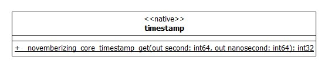

# NOVEMBERIZING CORE TIMESTAMP

현재 시스템에 설정된 초단위와 나노초 단위 타임스탬트 값을 가지고 올 수 있는 메서드입니다.



## PROTOTYPE

```
__novemberizing_core_timestamp_get(out second: int64, out nanosecond: int64): int32
```

현재 타임스탬프 값을 가지고 오는 초단위와 나노초 단위로 가지고 올 수 있는 메서드입니다.

> WINDOWS 의 경우 100ns 단위까지 가지고 올 수 있습니다. 리눅스의 경우는 1ns 단위로 가지고 옵니다.

## PARAMETER

| PARAMETER  | TYPE    | DIRECTION | DESCRIPTION |
| ---------- | ------- | --------- | ----------- |
| second     | int64 * | out       | second      |
| nanosecond | int64 * | out       | nanosecond  |

second, nanosecond 모두 int64 타입입니다. 만약에 사용자가 NULL로 설정하면, 그 값은 가지고 오지 않습니다.

## RETURN

| TYPE  | DESCRIPTION            |
| ----- | ---------------------- |
| int32 | success(0) or fail(-1) |

리눅스의 경우 내부적으로 clock_gettime 을 호출하는데, 그 함수가 오작동하면 fail 을 출력하고 그렇지 않은 경우 success 를 출력합니다. 윈도우즈의 경우 오로지 success 만 호출 합니다.

## SAMPLE

```
#include <novemberizing.h>

#include <stdio.h>
#include <errno.h>

int main(int argc, char ** argv)
{
    _int64 second = 0;
    _int64 nanosecond = 0;
    if(__novemberizing_core_timestamp_get(&second, &nanosecond) == 0)
    {
#ifdef    WIN32
        printf("timestamp: %lld.%09lld\n", second, nanosecond);
#else  // WIN32
        printf("timestamp: %ld.%09ld\n", second, nanosecond);
#endif // WIN32
    }
    else
    {
        printf("fail to __novemberizing_core_timestamp_get(...) caused by %d\n", errno);
    }
    return 0;
}
```

샘플 코드는 간단합니다. 다만 콘솔창에 출력을 할 때, 운영체제의 속성에 따라서 위처럼 포맷을 달리 설정해주어야 합니다.
