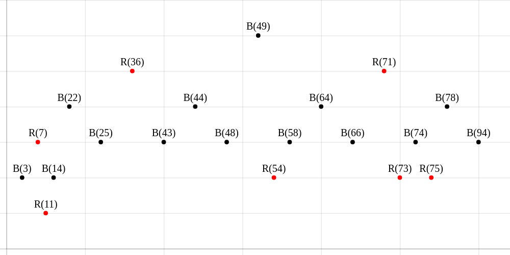

# RED BLACK TREE VISUALIZATION

> A simple visualization for red black tree.
> 
> _[view](https://iticworld.github.io/portfolio/red-black-tree-visualization-using-emscripten-chartjs/index.html)_
> /
> _[repository](https://github.com/iticworld/programming/tree/master/data.structure/red.black.tree)_
> /
> _[emscripten](http://kripken.github.io/emscripten-site/)_
> /
> _[chartjs](https://www.chartjs.org/)_
> /
> _c_



## HOW TO BUILD

```
wget https://raw.githubusercontent.com/novemberizing/javascript/master/novemberizing.js
emcc main.c node.c tree.c util.c -o red.black.tree.js -s "EXTRA_EXPORTED_RUNTIME_METHODS=['Pointer_stringify']"
```

## RED BLACK TREE

___<u>self balancing binary search tree</u>___

- A node is either red or black.
- The root and leaves(nil) are black.
- If a node is red, then its children are black.
- All paths from a node to its nil descendants contain the same number of black nodes.

> The longest path is no more than twice the length of the shortest path.

- insert node and color it red and fix violation
- delete node and check sibling node and fix violation
