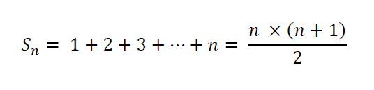

# SUM FROM 1 TO N

To solve Project Euler’s first problem, as a programmer,
I wrote a very poor but robust algorithm that uses the for statement to get “1 + 2+ 3 + …… + n”.
I am slightly embarrassed after reading the solution.
Now I think I have to open my mathematics book and study again.
The sum of the sequences is obtained by one operator rather that by a loop. It is also called the sum of Gauss.



The above formula is that easily finds the sum of the isometric sequences.
With this formula, the first problem of Project Euler is easily solved.

```
#include <novemberizing/integer.hh>

using namespace novemberizing;

static integer sum(integer n, integer below)
{
    integer p = below / n
    return n * (p * (p + 1)) / 2;
}

int main(int argc, char ** argv)
{
    integer v = 0;
    for(integer i = 0; i < 1000; ++i)
    {
        if(i % 3 == 0 || i % 5 == 0)
        {
            v += i;
        }
    }
    
    v = sum(3) + sum(5) - sum(15);
    return 0;
}
```

So how does the sum of the isometric sequences become a simple formula?


The concept is easy.
Think of the twice the summation. And write one from 1 to n and the other one from n to 1.
You will find that adding 1 + n to each of the numbers can add up to n times.
The actual value you want to find is the value to sum from 1 and n once.
Therefore, dividing the value of (1 + n) x n, divided by 2, is a formula to sum from 1 to n.
The loop changes to an operation, which means that O(n) has become O(1).

> I am trying to solve Project Euler using the built-in INTEGER class.
> I created an INTEGER class that represents a number greater than or equal to 128 bits or 256 bits,
> and supports arithmetic operations on it. Currently supports arithmetic and simple shift operations.
>
> - [GITHUB REPOSITORY TO SOLVE MATHEMATICS PROBLEMS USING NOVEMBERIZING’S INTEGER](https://github.com/iticworld/euler)
> - [\[PROJECT EULER\] MULTIPLES 3 AND 5](https://projecteuler.net/problem=1)
> - [NOVEMBERIZING C++](https://github.com/novemberizing/cpp)