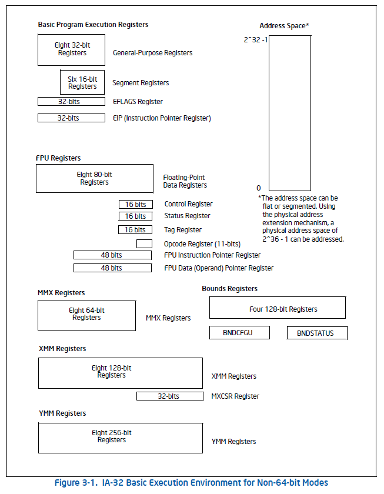
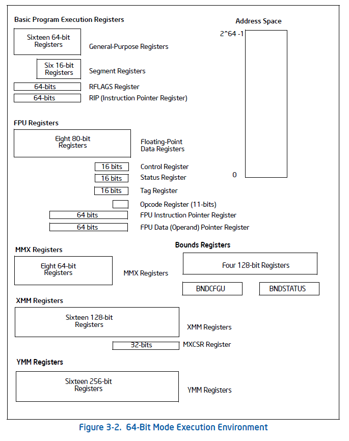

# 3.2. OVERVIEW OF THE BASIC EXECUTION ENVIRONMENT

Any program or task running on an IA-32 processor is given a set of resources for executing instruction and for storing code, data, and state information. These resources (described briefly in the following paragraphs and shown in Figure 3-1) make up the basic execution environment for an IA-32 processor.

An Intel 64 processor supports the basic execution environment of an IA-32 processor, and a similar environment under IA-32e mode that can execute 64-bit programs (64-bit sub-mode) and 32-bit programs (compatibility sub mode).

The basic execution environment is used jointly by the application programs and the operating system or executive running on the processor:

- Address space: Any task or program running on an IA-32 processor can address a linear space of up to 4 GBytes (2^32 bytes) and a physical address space of up to 64 GBytes (2^36 bytes). See Section 3.3.6, "Extended Physical Addressing In Protected Mode", for more information about addressing an address space greater than 4 GBytes.

- Basic program execution registers - The eight general-purpose registers, the six segment registers, the EFLAGS register, and EIP (instruction poiinter) register comprise a basic execution environment in which to exectue a set of general purpose instructions. These instructions perform basic integer arithmetic on byte, word, and doubleword integers, handle program flow control, operate on bit and byte strings, and address memory. See Section 3.4, "Basic Program Execution Registers," for more information about these registers.

- x87 FPU registers - The eight x87 FPU data registers, the x87 FPU control register, the status register, the x87 FPU instruction pointer register, the x87 FPU operand (data) pointer register, the x87 FPU tag register, and the x87 FPU opcode register provide an execution environment for operating on single precision, double precision, and double extended precision floating point values, word integers, double word integers, quadword integers, and binary coded decimal(BCD) values. See Section 8.1, "x87 FPU Execution Environment," for more information about these registers.

- MMX registers - The eight MMX regisgters supports execution of single instruction, multiple-data (SIMD) operations on 64 bit packed byte, word, and doubleword integers. See Section 9.2, "The MMX Technology Programming Environment," for more information about these register.

- XMM registers - The eight XMM data registers and the MXCSR register support execution of SIMD operations on 128-bit packed single precision and double precision floating point values and on 128 bit packed byte, word, double word, and quad word integers. See Section 10.2, "SSE Programming Environment", for more information about these registers.

- YMM registers - The YMM data registers support execution of 256-bit SIMD operations on 256-bit packed single-precision and double precision floating point values and on 256 bit packed byte, word, double word, and quad word integers.

- Bounds registers - Each of the BND0 - BND3 register stores the lower and upper bounds (64 bits each) associated with the pointer to a memory buffer. They support execution of the Intel MPX instructions.

- BNDXFGU and BNDSTATUS - BNDCFGU configures user mode MPX operations on bounds checking. BNDSTATUS provides additional information on the #BR caused by ab MPX operation.

- Stack - To support procedure or subroutine calls and the passing of parameters between procedures or subroutines, a stack and stack management resources are included in the execution environment. The stack (not shown in Figure 3-1) is located in memory. See Section 6.2, "Stacks", for more information about stack structure.

In addition to the resources provided in the basic execution environment, the IA-32 architecture provides the following resources as part of its system-level architecture. They provide extensive support for operating system and system development software. Except for the I/O ports, the system resources are described in detail in the Intel 64 and IA-32 Architectures Software Developer's Manual, Volumes 3A & 3B.

- I/O ports - The IA-32 architecture supports a transfers of data to and from input/output (I/O) ports. See Chapter 18, "Input/Output," in this volume.

- Control registers - The five control registers (CR0 through CR4) determine the operating mode of the processor and the characteristics of the currently executing task. See Chapter 2, "System Architecture Overview," in the Intel 64 and IA-32 Architectures Software Developer's Manual, Volume 3A.

- Memory management registers - The GDTR, IDTR, task register, and LDTR specify the locations of data structures used in protected mode memory management. See Chapter 2, "System Architecture Overview," in the Intel 64 and IA-32 Architectures Software Developer's Manual, Volume 3A.

- Debug registers - The debug registers (DR0 through DR7) control and allow monitoring of the processor's debugging operations. See in the Intel 64 and IA-32 Architectures Software Developer's Manual, Volume 3B.

- Memory type range registers (MTRRs) - The MTRRs are used to assign memory types to regions of memory. See the sections on MTRRs in the Intel 64 and IA-32 Architectures Software Developer's Manual, Volumes 3A & 3B.

- Machine specific registers (MSRs) - The processor provides a variety of machine specific registers that are used to control and report on processor performance. Virtually all MSRs handle system related functions and are not accessible to an application program. One exception to this rule is the timestamp counter. The MSRs are described in Chapter 2, "Model-Specific Registers (MSRs)" of the Intel 64 and IA-32 Architectures Software Developer's Manual, Volume 4.

- Machine check registers - The machine check registers consist of a set of control, status, and error reporting MSRs that are used to detect and report on hardware (macine) errors. See Chapter 15, "Machine Check Architecture," of the Intel 64 and IA-32 Architectures Software Developer's Manual, Volume 3A.

- Performance monitoring counters - The performance monitoring counters allow processor performance events to be monitored. See Chapter 18, "Performance Monitoring," in the Intel 64 and IA-32 Architectures Software Developer's Manual, Volume 3B.

The remainder of this chapter describes the organization of memory and the address space, the basic program execution registers, and addressing modes. Refer to the following chapters in this volume for descriptions of the other program execution resources shown in Figure 3-1:

- x87 FPU registers - See Chapter 8, "Programming with the x87 FPU."

- MMX registers - See Chapter 9, "Programming with Intel MMX Technology"

- XMM registers - See Chapter 10, "Programming with Intel Streaming SIMD Extensions (Intel SSE)" Chapter 11, "Programming with Intel Streaming SIMD Extension 2 (Intel SSE2)," and Chapter 12, "Programming with Intel SSE3, SSSE2, Intel SSE4 and Intel AESNI."

- YMM registers - See Chapter 14, "Programming with AVX, FMA and AVX2"

- BND registers, BNDCFGU, BNDSTATUS - See Chapter 13, "Managing State Using the XSAVE Feature Set," and Chapter 17, "Intel MPX"

- Stack implementation and procedure calls - See Chapter 6, "Procedure Calls, Interrupts, and Exceptions."

### 3.2.1. 64 BIT MODE EXECUTION ENVIRONMENT

The execution environment for 64 bit mode is similar to that described in Section 3.2. The following paragraphs describe the differences that apply.

- Address space - A task or program running in 64 bit mode on an IA 32 processor can address linear address space of up to square(2, 64) bytes (subject to the canonical address requirement described in Section 3.3.7.1) and physical address space of up to square(2, 46) bytes. Software can query CPUID for the physial address zie supported by a processor.

- Basic Program execution registers - The number of general purpose registers (GPRs) available is 16. GPRs are 64-bits wid and they support operations on byte, word, doubleword, and quadword integers. Accessing byte registers is done uniformly to the lowest 8 bits. The instruction pointer register becomes 64 bits. The EFLAGS register is extended to 64 bits wide, and is referred to as the RFLAGS register, The upper 32 bits of RFLAGS is reserved. The lower 32 bits of RFLAGS is the same as EFLAGS. See Figure 3-2

- XMM registers - There are 16 XMM data register for SIMD operations. See Section 10.2 "SSE Programming Environment" for more information about these registers.

- YMM registers - There are 16 YMM data registers for SIMD operations. See Chapter 14, "Programming wiht AVX, FMA ans AVX2" for more information about these registers.

- BND registers, BNDCFGU, BNDSTATUS - See Chapter 13, "Managing State Using the XSAVE Feature Set" and Chapter 17, "Intel MPX"

- Stack - The stack pointer size is 64 bits. Stack size is not controlled by a bit in the SS descriptor (as it is in non-64-bit modes) nor can the pointer size be overridden by an instruciton prefix.

- Control registers - Control registers expand to 64 bits. A new control register (the task priority register: CR8 or TPR) has been added. See Chapter 2, "Intel 64 and IA-32 Architectures," in this volume.

- Debug register - Debug registers expand to 64 bits. See Chapter 17, "Debug, Branch Profilem TSC, and Quality of Service" in the Intel 64 and IA-32 Architectures Software Developer's Manual, Volume 3A.

- Descriptor table register - The global descriptor table register (GDTR) and interrupt descriptor table register (IDTR) expand to 10 bytes so that they can hold a full 64-bit base address. The local descriptor table register(LDTR) and the task tegister (TR) also expand to hold a full 64-bit base address.

