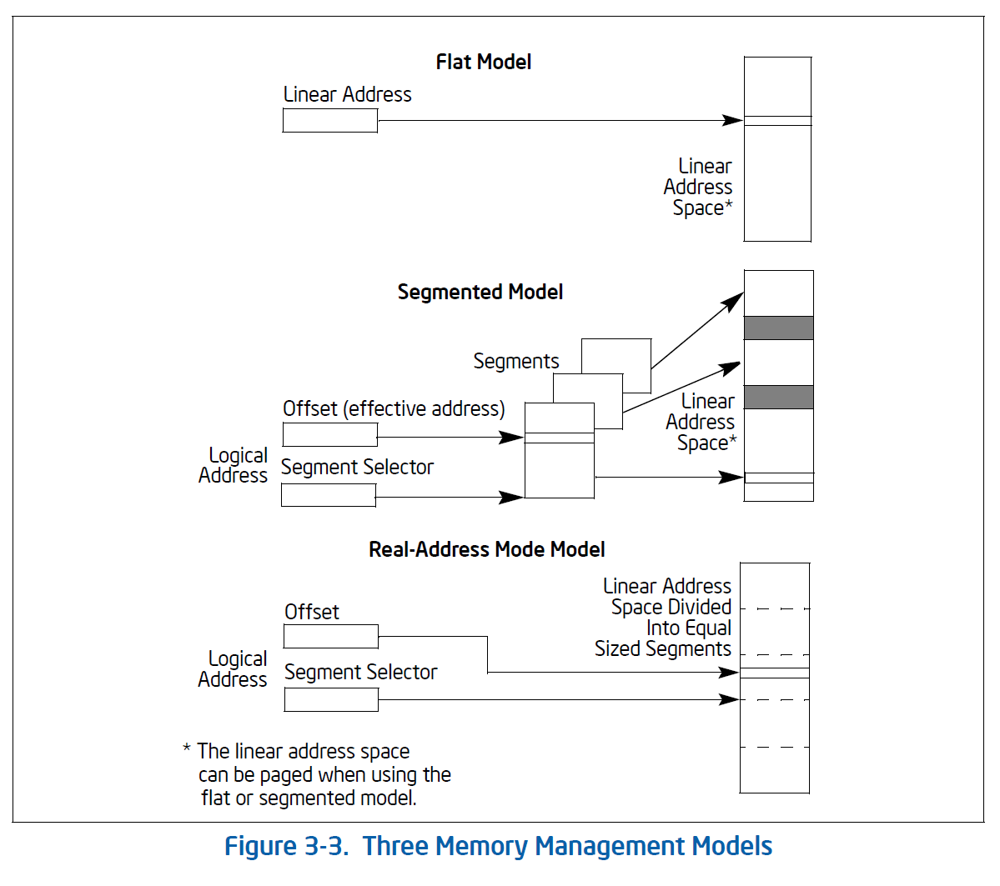

# 3.3 MEMORY ORGANIZATION

The memory that the processor addresses on its bus is called physical memory. Physical memory is organized as a sequence of 8 bit bytes.
Each byte is assigned a unique address, called a physical address. The physical address space ranges from zero to a maximum of 2^36 - 1 (64 GBytes) if the processor does not support Intel 64 architecture. Inter 64 architecture introduces a changes in physical and linear address space; these are described in Section 3.3.3, Section 3.3.4, and Section 3.3.7.

Virtually any operating system or executive designed to work with an IA-32 or Intel 64 processor will use the processor's memory management facilities to access memory. These facilities provide features such as segmentation and paging, which allow memory to be managed efficiently and reliably. Memory management is described in detail int Chapter 3, "Protected-Mode Memory Management," in the Intel 64 and IA-32 Architecture Software Developer's Manual, Volume 3A. The following paragraphs describe the basic methods of addressing memory when memory management is used.

## 3.3.1 IA-32 MEMORY MODEL

When employing the processor's memory management facilities, programs do not directly address physical memory. Instead, they access memory using one of three memory models: flat, segmented, or real address mode:

- Flat memory model - Memory appears to program as a single, continuous address space (Figure 3-3). This space is called a linear address space. Code, data, and stacks are all contained in this address space. Linear address space is byte addressable, with addresses running contiguously from 0 to 2^32 - 1 (if not in 64-bit mode). An address for any byte in linear address space is called a linear address.

- Segmented memory model - Memory appears to a program as a group of independent address spaces called segments. Code, data and stacks are typically contained in separate segments. To address a byte in a segment, a program issues a logical address. This consist of a segment selector and an offset (logical addresses are often referred to as far pointers). The segment selector identifies the segment to be accessed and the offset identifies a byte in the address space of the segment. Programs running on an IA-32 processor can address up to 16,383 segments of different sizes and types, and each segment can be as large as 2^32 bytes.

Internally, all the segments that are defined for a system are mapped into the processor's linear address space. TO access a memory location, the processor thus translates each logical address into a linear address. This translation is transparent to the application program.

The primary reason for using segmented memory is to increase the reliability of programs and systems. For example, placing a program's stack in a separate segment prevents the stack from growing into the code or data space and overwriting instructions or data, respectively.

- Real address mode memory model - This is the memory model from the Intel 8086 processor. It is supported to provide compatibility with existing programs written to run on the Intel 8086 processor. The real address mode uses a specific implementation of segmented memory in which the linear address space for the program and the operating system/executive consists of an array of segments of up to 64 KBytes in size each. The maximum size of the linear address space in real-address mode is 2^20 bytes.

See also: Chapter 20, "8086 Emulation," Intel 64 and IA-32 Architectures Software Developer's Manual, Volume 3B.

