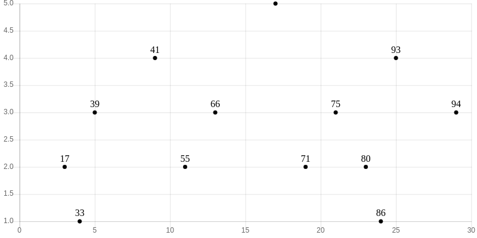

# BINARY SEARCH TREE VISUALIZATION

simple visualization for binary search tree.

 - emscripten
 - c
 - chartjs



[view binary search tree visualization](https://iticworld.github.io/portfolio/binary-search-tree-visualization-using-emscripten-chartjs/index.html)

__EMSCRIPTEN BUILD__

```
emcc main.c -o binary.search.tree.js -s "EXTRA_EXPORTED_RUNTIME_METHODS=['Pointer_stringify']"
```

## PROPERTIES

 - The left subtree of a node contains only nodes with keys lesser than the node's key.
 - The right subtree of a node contains only nodes with keys greater than the node's key.
 - The left and right subtree each must also be a binary search tree.
 
## ALGORITHM

__SEARCH__

```
SEARCH(T, V)
N = T.ROOT
WHILE N != NULL THEN
    IF N.VALUE == V THEN
        RETURN N
    ELSE IF N.VALUE < V THEN
        N = N.RIGHT
    ELSE
        N = N.LEFT
    END
END
RETURN NULL
```

__INSERT__

```
INSERT(T, V)
IF T.ROOT == NULL THEN
    T.ROOT = NEW(V)
    RETURN T.ROOT
END
N = T.ROOT
WHILE N != NULL
    IF N.VALUE == V THEN
        RETURN N
    ELSE IF N.VALUE < V THEN
        IF N.RIGHT == NULL THEN
            N.RIGHT = NEW(V)
            N.RIGHT.PARENT = N;
            RETURN N.RIGHT
        ELSE
            N = N.RIGHT
        END
    ELSE
        IF N.LEFT == NULL THEN
            N.LEFT = NEW(V)
            N.LEFT.PARENT = N;
            RETURN N.LEFT
        ELSE
            N = N.LEFT
        END
    END
END
```

__DELETION__

```
DELETE(T, V)
N = T.ROOT
WHILE N != NULL THEN
    IF N.VALUE == V THEN
        IF N.LEFT == NULL THEN
            IF N.PARENT != NULL
                IF N.PARENT.LEFT == N THEN
                    N.PARENT.LEFT = N.RIGHT
                ELSE
                    N.PARENT.RIGHT = N.RIGHT
                END
            ELSE
                T.ROOT = N.RIGHT
            END
            IF N.RIGHT != NULL THEN
                N.RIGHT.PARENT = N.PARENT
            END
        ELSE IF N.RIGHT == NULL THEN
        IF N.PARENT != NULL
            IF N.PARENT.LEFT == N THEN
                    N.PARENT.LEFT = N.LEFT
                ELSE
                    N.PARENT.RIGHT = N.LEFT
                END
            ELSE
                T.ROOT = N.LEFT
            END
            N.LEFT.PARENT = N.PARENT
        ELSE
            MIN = MINIMUM(N.RIGHT)
            IF MIN.PARENT.LEFT == MIN THEN
                MIN.PARENT.LEFT = MIN.RIGHT
            ELSE
                MIN.PARENT.RIGHT = MIN.RIGHT
            END
            IF MIN.RIGHT != NULL THEN
                MIN.RIGHT.PARENT = MIN.PARENT
            END
            IF N.PARENT != NULL THEN
                IF N.PARENT.LEFT == N THEN
                    N.PARENT.LEFT = MIN
                ELSE
                    N.PARENT.RIGHT = MIN
                END
            ELSE
                T.ROOT = MIN
            END
            MIN.PARENT = N.PARENT
        END
        CLEAR(N)
        RETURN N
    ELSE IF N.VALUE < V THEN
        N = N.RIGHT
    ELSE
        N = N.LEFT
    END
END
RETURN NULL
```