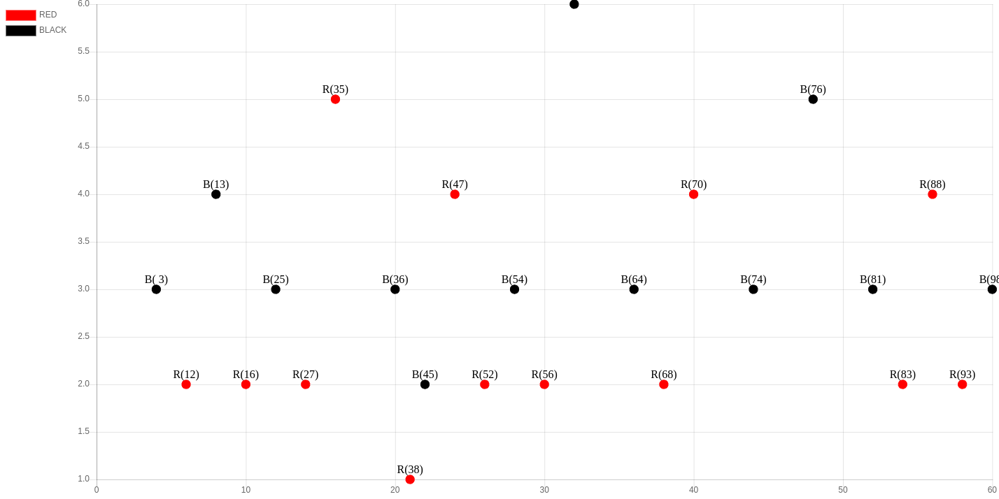

# RED BLACK TREE VISUALIZATION USING CHARTJS

> simple red black tree visualization using chartjs.

 - chartjs

[view red black tree visualization](https://iticworld.github.io/portfolio/red-black-tree-visualization/index.html)
