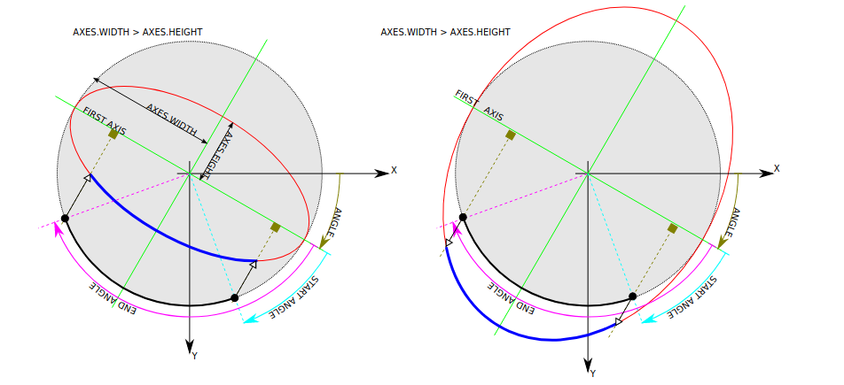

# ELLIPSE

```c++
#include <opencv2/imgproc.hpp>

void cv::ellipse(InputOutputArray image,
                 Point            center,
                 Size             axes,
                 double           angle,
                 double           start,
                 double           end,
                 const Scalar &   color,
                 int              thickness = 1,
                 int              type = LINE_8,
                 int              shift = 0)
```

Draws a simple or thick elliptic arc or fills an ellipse sector.

The function cv::ellipse with more parameters draws an ellipse outline, a filled ellipse, an elliptic arc, or a filled ellipse sector. The drawing code uses general parametric form. A piecewise-linear curve is used to approximate the elliptic arc boundary. If you need more control of the ellipse rendering, you can retrieve the curve using ellipse2Poly and then render it with polylines or fill with fillPoly. If you use the first variant of the function ans want to draw the whole ellipse, not an arc, pass start = 0, and end = 360. If start is greater than end, the are swapped. The figure below explains the meaning of the parameters to draw the buld arc.



## PARAMETER

| PARAMETER | TYPE | DESCRIPTION |
| --------- | ---- | ----------- |
| image     | InputOutputArray | image |
| center    | Point            | center of the ellipse |
| axes      | Size             | Half of the size of ellipse main axes. |
| angle     | double           | ellipse rotation angle in degrees.     |
| start     | double           | starting angle of the elliptic arc in degrees. |
| end       | double           | ending angle of the elliptic arc in degrees.   |
| color     | Scalar           | ellipse color                                  |
| thickness | int              | thickness of the ellipse arc outline, if positive. Otherwise, this indicates that a filled ellipse sector is to be drawn. |
| type      | int              | type of the ellipse boundary. |
| shift     | int              | number of fractional bits in the coordinates of the center and values of axes. |

---

```sh
g++ -o ellipse.out ellipse.cpp -I/usr/local/include/opencv4 -L/usr/local/lib -lopencv_imgproc -lopencv_highgui -lopencv_core
```
